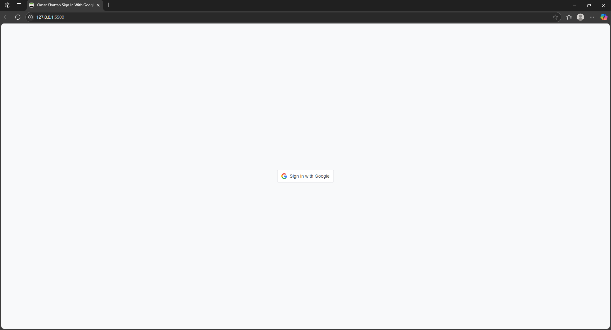

# Omar Khattab Sign In With Google

Google Sign-In demo using official Identity Services API, built with HTML, CSS, and vanilla JavaScript — secure, responsive, and privacy-friendly.

---

## 🚀 Overview

This is a lightweight demo project that integrates Google Sign-In authentication, allowing users to sign in using their Google account securely and easily.

---

## ✨ Features

- 🔐 Google OAuth 2.0 authentication  
- ✅ Easy to implement and customize  
- 📱 Responsive and user-friendly UI  
- ⚙️ Built using modern web technologies (HTML, CSS, JS)

---

## 🛠️ Technologies Used

- HTML5  
- CSS3  
- JavaScript (Vanilla)  
- Google Identity Services

---

## Project Website Preview

This is a demo preview image for the project.



---

## 📋 Usage Instructions

1. Clone this repository:
    ```bash
    git clone https://github.com/OmarxKhattab/omar-khattab-sign-in-with-google.git
    cd omar-khattab-sign-in-with-google
    code .
    ```

## License

This project is licensed under the terms of the [MIT License](LICENSE).